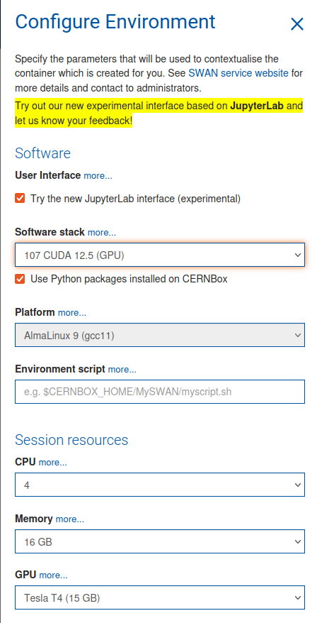

# SWAN Tutorial
Wakis introduction and hands-on examples prepared to run on CERN's SWAN Service: https://swan.web.cern.ch/swan/:

[][gallery_url]

Involving all our in-house python-packages of the impedance assessment workflow: 
* [`Wakis`](https://github.com/ImpedanCEI/wakis) for the 3D electromagnetic wakefield simulations,
* [`IDDEFIX`](https://github.com/ImpedanCEI/IDDEFIX) for partially decayed wake extrapolation,
* [`BIHC`](https://github.com/ImpedanCEI/BIHC) for impedance-induced beam power loss, and
* [`neffint`](https://github.com/ImpedanCEI/neffint) for impedance to wake function conversion for beam dynamics simulations.

## SWAN confoguration
The suggested configuration for running Wakis on SWAN is to profit from the GPU resources available: Tesla T4(15 Gb) and A100 partition (40 Gb):

<p align="center">
  
</p>

We suggest using the JupyterLab interface for easy access to the terminal for monitoring and better display of on-the-fly generated plots. 
* ☑️ `Try the new JupyterLab interface (experimental)` - Recommended

To use Wakis on SWAN -or any user installed packages-, the following checkbox should be ticked:
* ☑️ `Use Python packages installed on CERNBox` - Needed


## Installation
The installation on SWAN is done from the terminal (it can be opened from the launcher) and the `pip install`-ed packages are stored in your EOS:
* `/eos/user/u/username/.local/bin`
Also, you can install wakis from [GitHub](https://github.com/ImpedanCEI/wakis) to have the latest changes into your conda environment:

```bash
pip install wakis['notebook']
pip install bihc neffint iddefix # optional satellite packages

# To get the latest version from Github (non-deployed)
pip uninstall wakis -y
pip install git+https://github.com/ImpedanCEI/wakis.git
```

To generate 3D `PyVista` plots on SWAN, since it does not run an X-server, an extra step is needed to use OSMesa offscreen:
```bash
pip uninstall vtk -y
pip install --extra-index-url https://wheels.vtk.org vtk-osmesa
```
The 3D plots will be saved as an `HTML` scene that can be embedded with `IFrame` in the notebook.

To run mpi simulations in notebook 003, we need to update the `ipyparallel` package avialable in SWAN and install mpi4py:
```bash
pip install ipyparallel==9.0.1
pip install mpi4py
```

[gallery_url]:https://cern.ch/swanserver/cgi-bin/go?projurl=https://github.com/dpiparo/swanExamples.git